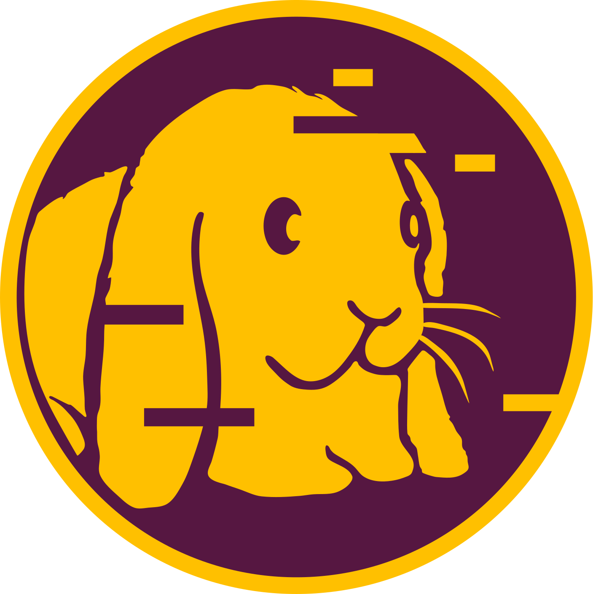

### Hi there 👋
<!--
**chan233/chan233** is a ✨ _special_ ✨ repository because its `README.md` (this file) appears on your GitHub profile.

Here are some ideas to get you started:

- 🔭 I’m currently working on ...
- 🌱 I’m currently learning ...
- 👯 I’m looking to collaborate on ...
- 🤔 I’m looking for help with ...
- 💬 Ask me about ...
- 📫 How to reach me: ...
- 😄 Pronouns: ...
- ⚡ Fun fact: ...

-->
🌱 I’m currently learning Reverse Engineering,Fuzzing and Pwn.

<h2>🚀 Major Languages I Use</h2>

<h2>🚀 Reverse Tools I Use</h2>

  

<h2>🚀 WebTools I Use</h2>

